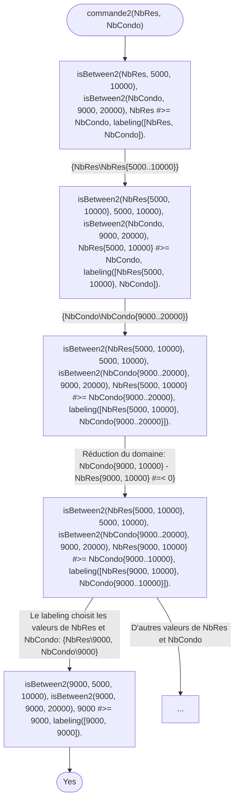

# 					
CR TP1 Programmation par contraintes
 

Julien LETOILE, Romain HUBERT

le 26/01/2021

## Table des matières

------

[TOC]

------

## I. <u>Réponses rédigées</u>

### Question 1.2

Prolog permet de tester automatiquement les contraintes sur toutes les données en les unifiant sous la forme d'arbres. Cela en fait un solveur de contraintes sur le domaine des arbres.

### Question 1.6

Prolog ne comprend pas les signes mathématiques, mais est capable de calculer de manière très efficace.
Si l'on pose le prédicat *>=* avant les appels à *isBetween*, on obtient un *instanciation fault*.
On parle d'approche "Generate and Test" puisque dans *commande*, on va d'abord générer les valeurs possibles avec les *isBetween*, puis on teste les valeurs générés avec l'inégalité.

### Question 1.7

En remplaçant les prédicats *isBetween* et *>=* par les conraintes *Var #:: Min..Max* et *#>=*, on obtient la réponse suivante:
> isBetween2(X, -2, 5).
> 
> X = X{-2 .. 5}
> Yes (0.00s cpu)

*{-2 .. 5}* correspond à l'intervalle des valeurs possibles de X répondant à la contrainte.

### Question 1.12

Après exécution de la requête ***X #:: -10..10, vabs(X, Y).***, on obtient la réponse suivante:

> X = 0  
> Y = 0  
> Yes (0.00s cpu, solution 1, maybe more) ? ;
>
> X = 1  
> Y = 1  
> Yes (0.00s cpu, solution 2, maybe more) ? ;
>
> X = 2  
> Y = 2  
> Yes (0.00s cpu, solution 3, maybe more) ? ;
>
> ...
>
> X = -9  
> Y = 9  
> Yes (0.02s cpu, solution 20, maybe more) ? ;
>
> X = -10  
> Y = 10  
> Yes (0.02s cpu, solution 21)

Après exécution de la requête ***X #:: -10..10, vabsOr(X, Y).***, on obtient la réponse suivante:

> X = 0  
> Y = 0  
> Yes (0.00s cpu, solution 1, maybe more) ? ;  
>
> X = -10  
> Y = 10  
> Yes (0.00s cpu, solution 2, maybe more) ? ;  
>
> X = -9  
> Y = 9  
> Yes (0.00s cpu, solution 3, maybe more) ? ;  
>
> ...
>
> X = 9  
> Y = 9  
> Yes (0.00s cpu, solution 20, maybe more) ? ;
>
> X = 10  
> Y = 10  
> Yes (0.00s cpu, solution 21)

On remarque que les 2 sorties se ressemblent hormis une inversion des arrivées des valeurs de X. Prolog, dans *vabs*, cherche toutes les solutions de ***AbsVal #= Val*** puis les solutions de ***AbsVal #= -Val***. Alors que dans *vabsOr*, le labeling prend toutes les valeurs dans l'ordre.

### Question 1.15

Pour vérifier que cette suite est périodique de période 9, il suffit de montrer qu'il n'existe pas une suite qui n'est pas de période 9. Ainsi, une requête qui vérifie cela est:

>faitListe(X, 15, -100, 100), suite(X), non_periodique9(X), labeling(X).
>
>No (0.75 cpu)

Donc la suite est de période 9.

## II. <u>Arbres de recherche</u>

### Question 1.5

Après exécution de la requête ***commande(-NbResistance, -NbCondensateur).***, on obtient l'arbre élagué suivant :

<i><u>Figure 1: Arbre de commande(-,-)</u></i>

### Question 1.8

Après exécution de la requête ***commande2(-NbResistance, -NbCondensateur).***, on obtient l'arbre élagué suivant :

<i><u>Figure 2: Arbre de commande2(-,-)</u></i>

